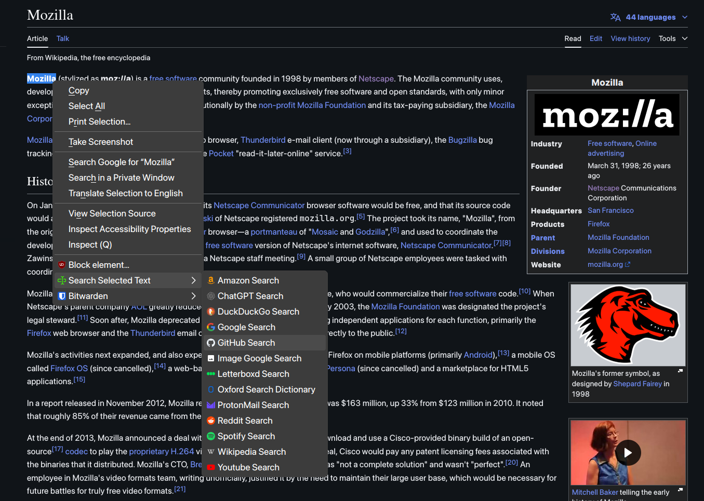

## Usage

1. Select text on a webpage
2. Right-click on the selected text
   - Either hit the keyboard shortcut for the search engine
   - Or choose a search engine from the context menu
3. The search results will open in a new tab

Currently supports the following search engines and services:
  - Amazon
  - ChatGPT
  - DuckDuckGo
  - GitHub
  - Google
  - Google Images
  - IMDb
  - Letterboxd
  - Oxford Dictionary
  - ProtonMail
  - Reddit
  - Spotify
  - Wikipedia
  - YouTube

More search engines and services can be added by modifying the `searchFunctions` object in the background script.

# Credits

Addon icon from [SVG Repo](https://www.svgrepo.com)

Brand icons from [Simple Icons](https://simpleicons.org)
